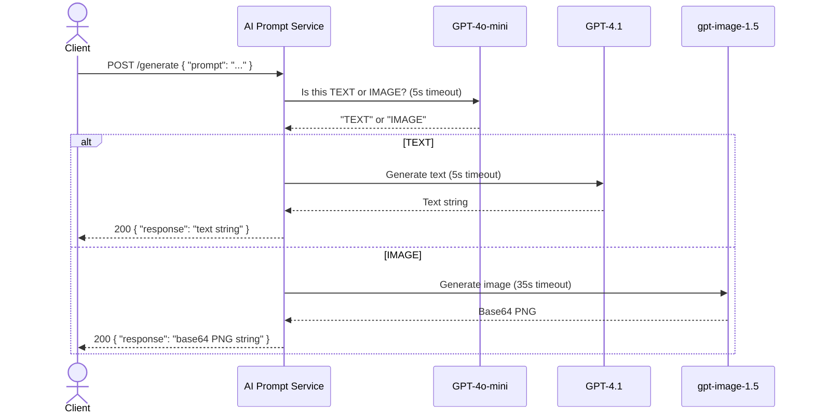

# AI Prompt Service

## Description

This microservice accepts a natural language prompt and automatically routes it to the appropriate OpenAI model based on intent. It classifies the prompt as either a **text** or **image** request, then returns the generated result. Clients do not need to specify the type — classification is handled internally.

- **Text prompts** are answered by GPT-4.1
- **Image prompts** are generated by gpt-image-1.5 and returned as a base64-encoded PNG

---

## Setup

1. Install dependencies:
   ```sh
   npm install
   ```

2. Set your OpenAI API key:
   ```sh
   export OPENAI_API_KEY="your-api-key-here"
   ```

3. Start the server:
   ```sh
   node service.js
   ```

The server runs on port 3000.

---

## Communication Contract

> **Do not change this contract.** Teammates depend on this interface.

### Base URL

```
http://localhost:3000
```

---

## How to REQUEST Data

Send a `POST` request to `/generate` with a JSON body containing a `prompt` field.

**Endpoint:** `POST /generate`

**Headers:**
```
Content-Type: application/json
```

**Body:**
```json
{
  "prompt": "Your prompt here"
}
```

**Example — text request:**
```sh
curl -X POST http://localhost:3000/generate \
  -H "Content-Type: application/json" \
  -d '{"prompt": "Explain what a REST API is in one sentence"}'
```

**Example — image request:**
```sh
curl -X POST http://localhost:3000/generate \
  -H "Content-Type: application/json" \
  -d '{"prompt": "A cartoon dog wearing a space suit"}'
```

---

## How to RECEIVE Data

The service always responds with JSON. The `response` field contains either a text string or a base64-encoded PNG image string depending on the prompt type.

**Success — text:**
```json
{
  "response": "A REST API is an interface that allows systems to communicate over HTTP using standard methods like GET and POST."
}
```

**Success — image:**
```json
{
  "response": "<base64-encoded PNG string>"
}
```

**Error:**
```json
{
  "error": "Image generation failed: Timed out after 35s"
}
```

**Rendering an image response in a browser:**
```html

```

**Saving an image response to a file:**
```sh
curl -s -X POST http://localhost:3000/generate \
  -H "Content-Type: application/json" \
  -d '{"prompt": "A sunset over the ocean"}' \
  | node -e "const d=require('fs');process.stdin.resume();let b='';process.stdin.on('data',c=>b+=c);process.stdin.on('end',()=>d.writeFileSync('image.png',Buffer.from(JSON.parse(b).response,'base64')))"
```

---

## UML Sequence Diagram

